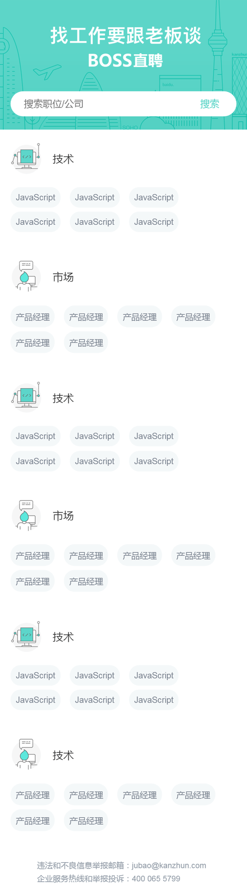
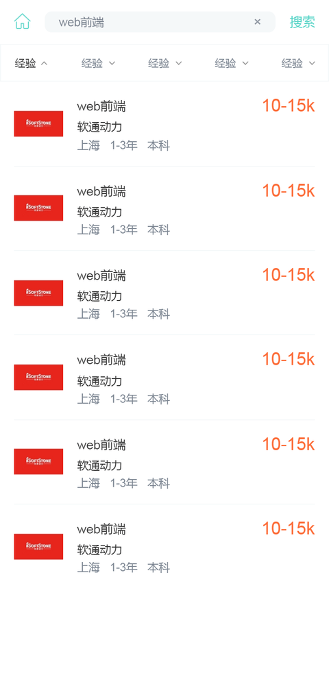
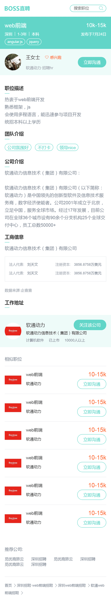

# boss-mobile-css

## How to start the project
Open the project directly in vscode, and install a plugin "Live Server", then right click the html file, click "Open with live server"

## 首页

## 职位列表页

## 职位详情页
